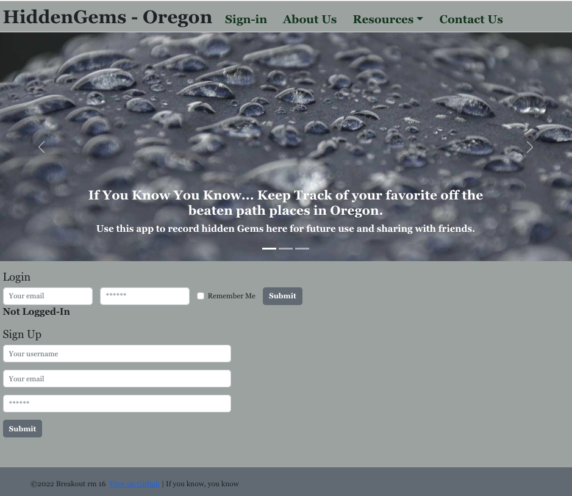
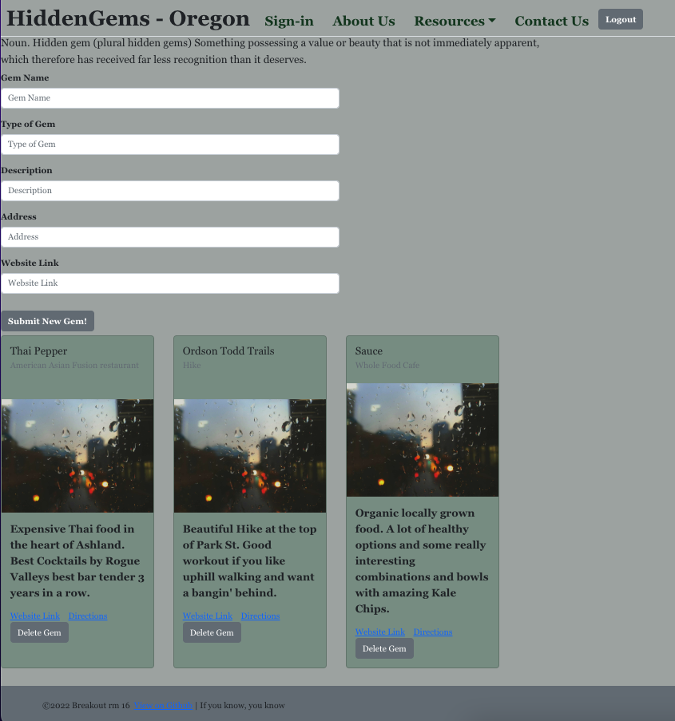

# HiddenGems 

## Description

An pepole who lives in different parts of Oregon, we know there are a lot of touristy spots and places that are unknown except to locals and the lucky few that come across them. 

We built an app to be able to login and document and save the "hidden gems" you find in oregon to be able to keep for yourself or share with others. 

This is meant to be somewhere you can share them or keep them private on your dashboard and be able to see other's Gems and add new ones yourself. 

This is for the user that does not want to be another tourist and wants to see or just save the real gems of the beautiful state of Oregon. 

## Table of Contents

- [Objectives](#objectives)
- [Installation](#installation)
- [Usage](#usage)
- [Assets](#assets)
- [Features](#features)
- [How to Contribute](#how-to-contribute)
- [License](#license)
- [Credits](#credits)

## Objectives 

As an application we would like it to follow the following criteria - 

* Use GraphQL with a node.js and express.js server
* Use MongoDB and Mongoose ODM for the database 
* Use queries and mutations for retrieving, adding, updating, and deleting data.
* Deploy with Heroku
* Polished UI that is Interactive 
* Must include Authentification 
* Protect sensitive API key information on the server
* Must be mobile friendly 

## Installation

- [Heroku link](https://stormy-retreat-53284.herokuapp.com/)

## Usage

* No need to install - Just follow the above Heroku link

### Screenshots

Homepage

Dashboard

## Assets

* React 
* MongoDB and Mongoose 
* Node.js 
* Express.js
* JWT
* GraphQL
* Reactstrap & Bootstrap
* Favicon.io

## Features

* Login and Logout 
* Create a new User 
* Save a hidden gem with information
* Delete a hidden gem

## How to Contribute

* (In Progress) We wanted a feature to contact to be able to send in feedback or suggestions to make the application something more collaborative with the users. 

## License

## Credits

* Gigi Debortoli [- GitHub](https://github.com/Gdebortoli)
* Francisca Hernandez [- GitHub](https://github.com/francisca-hernandez)
* Joseph Hernandez [- GitHub](https://github.com/jrhscoding)

### Minor contributions: 

* David Ricksgers [- GitHub](https://github.com/DavidRicksgers) - created logo for project 

